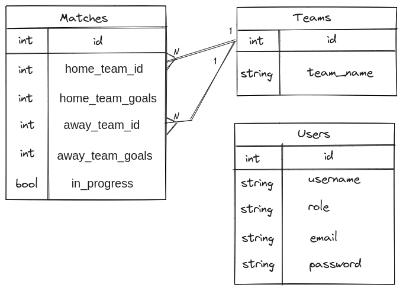

# ⚽ Welcome to Football Manager

## Languages

* [Português 🇧🇷](README.pt-br.md)

## Project summary

Full Stack project developed as a challenge for completing the Back-End module at [Trybe](https://www.betrybe.com)'s Web Development course.

It aims to integrate an HTTP server - application programming interface (API) implementing a RESTful pattern as a Back-End, developed using [Typescript](https://www.typescriptlang.org/) with [Express](https://expressjs.com/), [MySQL](https://www.mysql.com) and [Sequelize](https://sequelize.org) - to an user interface service - website Front-End, developed in [React](https://react.dev) - using [Docker](https://www.docker.com/products/docker-desktop/) to containerize and orchestrate the solution: an app to handle teams, matches, scores and ranking for football tournment management.

For Quality Assurance, unit, integration and end-to-end test suites use [Puppeteer](https://pptr.dev), [Jest](https://jestjs.io/), [Mocha](https://mochajs.org) and [Sinon](https://sinonjs.org).

## Tech Stack

| Front-End | Back-End   | Authentication | HTTP Server | Database | ORM           | Testing   | Packaging | Orchestration  |
|:---------:|:----------:|----------------|:-----------:|:--------:|:-------------:|:---------:|:---------:|:--------------:|
| React     | TypeScript | BCrypt.js      | Express     | MySQL    | Sequelize     | Puppeteer | Docker    | Docker-Compose |
|           | Node.js    | JWT            |             |          | Sequelize-CLI | Jest      | NPM       |                |
|           |            |                |             |          |               | Mocha     |           |                |

## Entities (or Models)

This application leverages a RESTful API to manipulate a persistent database keeping track of:

- Sistem users and their credentials
- Teams, with score and status
- Matches and their information

Using this data, a Leaderboard endpoint is provided to show tournment classification 🏆

### Entity relationship

The aforementioned entities interact between themselves as shown  below in the Entity Relationship Diagram (ERD):

## How to run this project

1. Using [Git](https://git-scm.com), clone this repository and enter its directory:

``
git clone git@github.com:fernando-costa/football-manager.git && cd football-manager/
``

2. Install project dependencies using [Node](https://nodejs.org/en/learn/getting-started/how-to-install-nodejs) and its package manager:

``
npm run install:apps
``

3. Orchestrate containerized services using [Docker](https://www.docker.com/products/docker-desktop/):

``
npm run compose:up
``

4. Start the HTTP service at the app/backend directory

``
cd app/backend && npm run start
``

5. Log in using the user interface running at: http://localhost:3000/login

To experiment different authentication and authorization profiles, use the following credentials:

| Role  | Username | Email           | Password     |
|-------|----------|:---------------:|:------------:|
| Admin | Admin    | admin@admin.com | secret_admin |
| User  | User     | user@user.com   | secret_user  |
