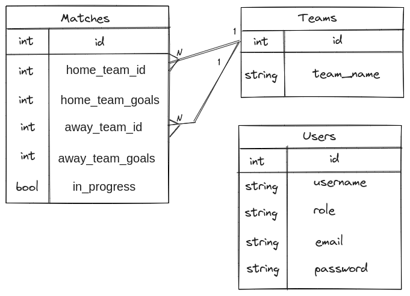

# ⚽ Bem vindo(a) ao Football Manager

## Linguagens

* [English 🇺🇸](README.md)

## Sumário do projeto

Projeto Full Stack desenvolvido como um desafio para completar o módulo de Back-End durante o curso de Desenvolvimento Web da [Trybe](https://www.betrybe.com)

Tem por objetivo integrar um servidor HTTP - Back-End, desenvolvido em [Typescript](https://www.typescriptlang.org/pt/) usando [Express](https://expressjs.com/pt-br/), [MySQL](https://www.mysql.com) e [Sequelize](https://sequelize.org) para oferecer uma interface de programação de aplicativo (API) no padrão RESTful - à um serviço de interface de usuário - página web como Front-End, desenvolvido com [React](https://pt-br.react.dev) - utilizando [Docker](https://www.docker.com/products/docker-desktop/) para containerização e orquestração da solução: uma aplicação para controle de times, partidas, pontuações e ranking para gestão de torneios de futebol.

Para Garantia de Qualidade (Quality Assurance), os testes unitários, de integração e de ponta-a-ponta usam as tecnologias [Puppeteer](https://pptr.dev), [Jest](https://jestjs.io/pt-BR/), [Mocha](https://mochajs.org) and [Sinon](https://sinonjs.org).

## Tech Stack

| Front-End | Back-End   | Autenticação | Servidor HTTP | Banco de Dados | ORM           | Testes   | Empacotamento | Orquestração  |
|:---------:|:----------:|----------------|:-----------:|:--------:|:-------------:|:---------:|:---------:|:--------------:|
| React     | TypeScript | BCrypt.js      | Express     | MySQL    | Sequelize     | Puppeteer | Docker    | Docker-Compose |
|           | Node.js    | JWT            |             |          | Sequelize-CLI | Jest      | NPM       |                |
|           |            |                |             |          |               | Mocha     |           |                |

## Entidades (ou modelos)

Esta aplicação usa uma API RESTful com um banco de dados para armazenar (de forma persistente) e manipular informações sobre:

- Usuários do sistema e suas credenciais
- Equipes, com pontuações e ranqueamento
- Partidas e suas informações

Usando estes dados, disponibiliza-se uma página de classificações dos torneios 🏆

### Relacionamento entre entidades

As entidades mencionadas interagem entre si como mostra o diagrama de relacionamentos entre entidades (DRE) abaixo:

## Como rodar este projeto

1. Com o [Git](https://git-scm.com) instalado, clone este repositório e acesse o diretório criado:

``
git clone git@github.com:fernando-costa/football-manager.git && cd football-manager/
``

2. Instale as dependências necessárias utilizando o [Node](https://nodejs.org/pt/learn/getting-started/how-to-install-nodejs) e seu gestor de pacotes:

``
npm run install:apps
``

3. Realize a orquestração dos serviços utilizando o [Docker](https://www.docker.com/products/docker-desktop/):

``
npm run compose:up
``

4. Inicialize o servidor HTTP no diretório app/backend

``
cd app/backend && npm run start
``

5. Faça o login na interface de usuário clicando em: http://localhost:3000/login

Para experimentar diferentes perfis de autorização e autenticação no website, duas credenciais são disponibilizadas:

| Papel  | Username | Email           | Senha     |
|-------|----------|:---------------:|:------------:|
| Administrador | Admin    | admin@admin.com | secret_admin |
| Usuário  | User     | user@user.com   | secret_user  |
